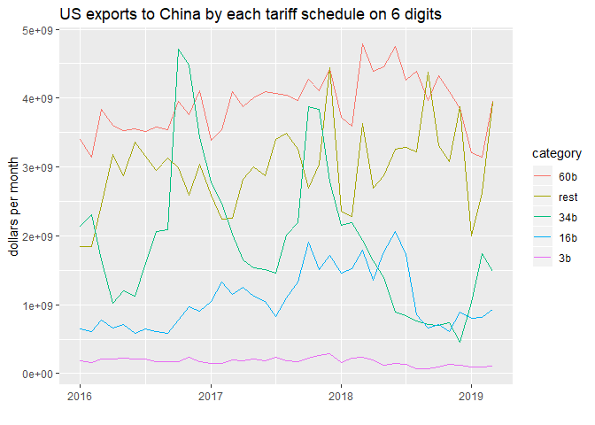

China hits back, half the size of its claim
================
Mitsuo Shiota
2019-04-24

  - [Summary](#summary)
  - [Libraries and functions](#libraries-and-functions)
  - [Get tariff lists from Excel and PDF
    files](#get-tariff-lists-from-excel-and-pdf-files)
  - [Get US export to China data in
    2017](#get-us-export-to-china-data-in-2017)
  - [US export values don’t add up to the Chinese
    claims](#us-export-values-dont-add-up-to-the-chinese-claims)
  - [Chinese may have calculated only on 6 digit
    codes](#chinese-may-have-calculated-only-on-6-digit-codes)
  - [Even if retaliation size is less than claimed, US exports are
    hurt](#even-if-retaliation-size-is-less-than-claimed-us-exports-are-hurt)

Updated: 2019-06-24

## Correction

I now believe that ["China hits back as much as the size of its claim"](https://github.com/mitsuoxv/us-tariffs-on-china/blob/master/China-hits-back3.md). I have learnt that HS 6 digit code values are not completely comparable between the US and China.

## Summary

After [I confirmed the USTR’s claims on how much imports from China are
affected by the tariffs they impose](README.md), I now turn to the
Chinese claims on how much imports from the United States are affected
by the retaliation tariffs they impose.

If my calculations using [Census Bureau U.S. International Trade
Data](https://www.census.gov/foreign-trade/data/) are right, the Chinese
hit-backs are half the size of their claims. My guess is that they
calculated the size based on HTS 6 digit codes, while they actually
impose tariffs based on both 6 and 8 digit codes.

Even if retaliation size is less than claimed, US exports are being
hurt.

## Libraries and functions

I use the same packages I used in [README.md](README.md).

I prepare some functions.

## Get tariff lists from Excel and PDF files

I download Excel and PDF files from the Chinese government sites. I
scratch HTS 8 digit codes from those files, and omit 0s in the codes in
the right, as I guess 0s in the right means inclusion of any numbers.
And I get the tariff list of each iteration or tranche like “3b”, “34b”,
“16b” and “60b”.

## Get US export to China data in 2017

``` r
# Get export from China data
# https://api.census.gov/data/timeseries/intltrade/exports/hs/variables.html

# country code, China 5700
# https://www.census.gov/foreign-trade/schedules/c/countryname.html

df2017 <- export_to_country(5700, 8, 2017)

total <- df2017 %>% 
  summarize(value = sum(value)) %>% 
  as.numeric() / 1000000000 
```

US exports to China in 2017 amount to 130 billion dollars in total. I
have got data by HTS 8 digit codes in “df2017”, a data frame of 3
columns of “time”, “hs” and “value.”

## US export values don’t add up to the Chinese claims

I prepare function to forward match 8 digit codes to less than 8 digit
codes, in order to make the look-up table of 2 columns, “hs” of unique
HTS 8 digit codes and “tariff” of tariff category like “34b”.

``` r
# add tariff category to df2017
lookup_hs <- tibble(hs = df2017$hs %>% unique())

# function
find_tariff <- function(hs, df) {
  patterns <- str_c("^", df$hs)

  result <- df[str_detect(hs, patterns), ] %>% 
    select(tariff) %>% 
    as.character()

  result
}
```

As there are duplication of HTS codes among “tariff”, I make one look-up
table for each “tariff”, left join it to the US export data, and
calculate sum of “value” by each “tariff”.

    ## # A tibble: 2 x 2
    ##   tariff              value
    ##   <chr>               <dbl>
    ## 1 3b             2280674828
    ## 2 character(0) 127612911888

US export value in 3b list is 2.28 billion dollars, and its ratio to the
Chinese claim is 0.76.

    ## # A tibble: 2 x 2
    ##   tariff              value
    ##   <chr>               <dbl>
    ## 1 34b            6853239849
    ## 2 character(0) 123040346867

US export value in 34b list is 6.85 billion dollars, and its ratio to
the Chinese claim is 0.2.

    ## # A tibble: 3 x 2
    ##   tariff                       value
    ##   <chr>                        <dbl>
    ## 1 16b                     9666733913
    ## 2 "c(\"16b\", \"16b\")"    287763821
    ## 3 character(0)          119939088982

US export value in 16b list is 9.95 billion dollars, and its ratio to
the Chinese claim is 0.62.

    ## # A tibble: 3 x 2
    ##   tariff                       value
    ##   <chr>                        <dbl>
    ## 1 60b                    27542146517
    ## 2 "c(\"60b\", \"60b\")"   2288987108
    ## 3 character(0)          100062453091

US export value in 60b list is 29.83 billion dollars, and its ratio to
the Chinese claim is 0.5.

Appearance of strange values like “c("16b", "16b")” and “c("60b",
"60b")” in “tariff” column means that some 8 digit codes fit multiple
codes in the look-up table I have prepared. Probably I have omitted too
many 0s in the look-up table.

In total, ignoring duplication, China claims it imposed tariffs on 113
billion dollars worth of imports from the US. If my calculation is
right, it really is 48.92 billion dollars, 0.43 of its claim.

Why are Chinese claims and my calculations so different? My guess is
that Chinese calculated values on 6 digit codes by ignoring 8 digit
codes. Let us validate it.

## Chinese may have calculated only on 6 digit codes

I cut HTS codes from 8 to 6 digits in the lists of Excel and PDF files.

And I get US export data in HTS 6 digits.

The results in “3b”, “34b”, “16b” and “60b” are 2.44, 29.17, 15.34 and
51.96 billion dollars respectively. Ratios to the Chinese claims are
0.81, 0.86, 0.96 and 0.87. As Chinese CIF import values are a little bit
larger than US FOB export values, and it takes some time to transport
goods from US to China, ratios can’t be exactly one. These numbers
support my guess that Chinese calculated values on 6 digit codes.

After I first finished writing this study, I have found [this
page](http://www.customs.go.jp/toukei/sankou/code/code_e.htm). Among HS
8 digits, the first 6 digits are the same across countries, while the
rest digits are domestic, thus can be different across countries. As far
as the first 6 digits are the same for US and China, my guess does not
change.

But I also have happened to find that as for the first 4 digits of
airplanes, US export stats code is “8800”, while [China import stats
code](http://english.customs.gov.cn/Statics/650f7297-a212-4f0e-a5a8-67422b04e550.html)
is “8802”. If this kind of interpretation difference is large enough to
make the first 6 digits non-comparable between US and China, I can’t
assume China imports from US on some goods are the same as US exports to
China. To completely validate my guess, I have to go for China import
stats, but so far I can’t find convenient APIs for them.

## Even if retaliation size is less than claimed, US exports are hurt

I get data from 2016 to 2019 based on 6 digit codes, and put tariff
category on each item.

There are 93 duplication. I use “first in” method to put category.

Retaliation effective dates are April 2, July 6, August 23, September
24, 2018 for “3b”, “34b”, “16b” and “60b” respectively. “3b”, “16b” and
“60b” are falling after the effective dates. “34b”, which includes
agricultural goods like soybeans, automobiles and marine products, is
seasonal, and failed to surge in July-December 2018. Non-retaliated
“rest” is not growing. Overall, US exports are hurt.

<!-- -->

EOL
