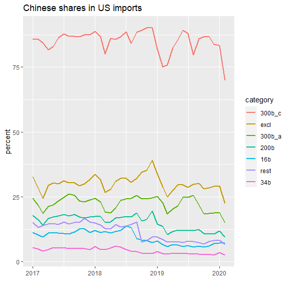
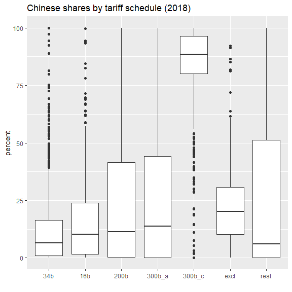

US tariffs on China
================
Mitsuo Shiota
2019-04-17

- [Summary](#summary)
- [Libraries and functions](#libraries-and-functions)
- [Load tariff lists and an exclusion
  list](#load-tariff-lists-and-an-exclusion-list)
- [Get international trade data, and confirm USTR
  claims](#get-international-trade-data-and-confirm-ustr-claims)
- [How much imports are excluded so
  far?](#how-much-imports-are-excluded-so-far)
- [Look at the Chinese share
  movements](#look-at-the-chinese-share-movements)

Updated: 2024-02-08

I separated the codes of extracting HTS from USTR site to [another
page](Extract-hts-from-USTR.md).

I added an analysis of who pays tariffs in [another page](Who-pays.md).

## Summary

- [Chinese shares in US imports in tariff imposed goods and others in
  pdf](output/chinese-shares.pdf)
- [Chinese shares in HTS 8 digit imports by tariff schedule (2018) in
  pdf](output/chinese-shares2.pdf)

I load an rdata file containing tariff lists and an exclusion list,
which I have saved in [the separate page](Extract-hts-from-USTR.md).
Note that I assume wrongly that granted product exclusion will never
expire, as I can’t take in expiration information.

Next, I get data via API from [Census Bureau U.S. International Trade
Data](https://www.census.gov/foreign-trade/data/), and confirm the each
list is really worth 34, 16 and 200 billion dollars respectively.

I calculate the Chinese shares on those tariff-imposed goods, excluded
goods and not-imposed goods, and look at the shares movements from
January 2017 to now to know how much trade diversion is going. I also
draw a boxplot of Chinese shares in HTS 10 digit imports in 2018.

## Libraries and functions

As usual, I attach tidyverse package. As I have found censusapi package
works, I use it.

Following the recommendation in [Internatinal Trade Data API User
Guide](https://www.census.gov/foreign-trade/reference/guides/Guide%20to%20International%20Trade%20Datasets.pdf)
provided by the US Census Bureau, I register API Key. I have added a
line CENSUS_API_KEY=xxxx to my .Renviron file, and I recall it by
`Sys.getenv("CENSUS_API_KEY")`.

``` r
census_api_key <- Sys.getenv("CENSUS_API_KEY")
```

I make functions to facilitate data transformation and acquisition.

## Load tariff lists and an exclusion list

``` r
load("data/tariff_list.rdata")

df_list_excl <- tibble(
  trf_excl = TRUE,
  hs10 = exclusion_list %>% unlist() %>% unique()
  ) %>% 
  arrange(hs10)
```

## Get international trade data, and confirm USTR claims

I struggle with which table I should use, and reach [this
page](https://www.census.gov/data/developers/data-sets/international-trade.html).
Next I struggle with which variables I should use, and reach [this
page](https://api.census.gov/data/timeseries/intltrade/imports/hs/variables.html).
I experiment a little, and know that GEN_CIF_MO = GEN_VAL_MO +
GEN_CHA_MO. Looks like CIF basis = FOB basis + Freight, insurance and
other charges. I choose GEN_CIF_MO as import value.

I get to know the country code of China is 5700 from [this
page](https://www.census.gov/foreign-trade/schedules/c/countryname.html).
OK, let us get data. Each download takes approximately half a minute.

Using the tariff lists of 8 digit HTS codes I extracted before, I check
if 2018 imports are really worth as much as 34, 16 and 200 billion
dollars as USTR claims. According to my calculation, 2018 imports are
32, 15.3 and 191.8 billion dollars. Ratios to the USTR claims are 0.94,
0.95 and 0.96. Little bit smaller, but basically confirm the USTR
claims.

2018 imports in List 4 Annex A (“300b_a”, effective on September 1,
2019) and Annex C (“300b_c”, scheduled to be effective on December 15,
2019, but postponed) are 110.1 and 160.4 billion dollars respectively.

## How much imports are excluded so far?

So far USTR announced exclusion lists 35 times. They specify products
simply by HTS 10 digit code, or by product description and HTS 10 digit
code it belong to. When I caluculate simply by HTS 10 digit code,
exclusions amount to 81.9 billion dollars annually.

## Look at the Chinese share movements

I get imports from China and total imports from January 2017 up to now,
and calculate Chinese shares in imports in each category of “34b”,
“16b”, “200b”, “300b_a”, “300b_c”, “excl”, and “rest”. “34b”, “16b”,
“200b”, “300b_a”, “300b_c” are imposed tariffs effective on July 6 2018,
August 23 2018, September 24 2018, September 1 2019 and (postponed)
December 15 2019, respectively. “excl” is exclusion granted so far.
“rest” is the rest.

What can I say from the chart below?

1.  Chinese shares are the lowest in 34b, next lowest in 16b, higher in
    200b, even higher in 300b_a and much much higer in 300b_c, exactly
    the same order of imposing tariffs. Actually USTR states that they
    separate 300b into 300b_a and 300b_c based on whether the Chinese
    shares are less than 75 percent or not in [this
    page](https://ustr.gov/sites/default/files/enforcement/301Investigations/Notice_of_Modification_%28List_4A_and_List_4B%29.pdf).
    USTR tends to choose lower Chinese share goods to impose tariffs
    first to avoid supply chain distruptions.

2.  In both 34b and 16b, Chinese shares rise just before the effective
    date, and decline thereafter. This pattern reflects that importers
    rush before and flee after.

3.  In 200b, I can see the small same pattern, but see bigger rise in
    December 2018 just before the tariff rates were scheduled to rise
    from 10 to 25 percent, and bigger decline thereafter. Looks like
    importers care little of 10 percent, but care much of 25 percent.

4.  Seasonality is observed. Chinese shares fall around March every
    year, as Chinese take long vacations when their New Year begins
    around February.

5.  China exports declined in February 2020, due to Covid-19 turmoil.

6.  In the tariff imposed goods, Chinese shares are declining. This
    means other countries’ shares are rising. Trade diversion is going
    on. However, there is a caveat.

7.  There is a gap between the US data and the Chinese data, probably
    because importers want to avoid tariffs. (I was impressed by [a
    tweet by Brad
    Setser](https://twitter.com/Brad_Setser/status/1667958832667021312))
    As I rely on the US data here, China’s share in the US imports may
    be underestimated.

<!-- -->

    ## Warning in responseFormat(raw): NAs introduced by coercion

<!-- -->

To confirm the point \#1 above, I draw the distribution of 2018 Chinese
shares in HTS 10 digit goods by each tariff schedule category. Chinese
shares in “excl” are much higher than “34b”, “16b” and “200b” from which
“excl” is excluded. As the shares in “300b_c” (postponed from the
scheduled December 15, 2019) are much much higer than those of “excl”,
USTR will receive massive product exclusion requests.

<!-- -->

EOL
