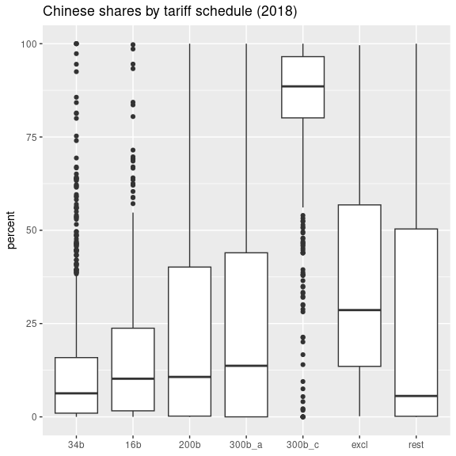

US tariffs on China
================
Mitsuo Shiota
2019-04-17

  - [Summary](#summary)
  - [Libraries and functions](#libraries-and-functions)
  - [Extract HTS 8 digit codes from pdf
    files](#extract-hts-8-digit-codes-from-pdf-files)
  - [Get international trade data, and confirm USTR
    claims](#get-international-trade-data-and-confirm-ustr-claims)
  - [Look at the Chinese share
    movements](#look-at-the-chinese-share-movements)

## Summary

  - [Chinese shares in US imports in tariff imposed goods and others in
    pdf](output/chinese-shares.pdf)
  - [Chinese shares in HTS 8 digit imports by tariff schedule (2018) in
    pdf](output/chinese-shares2.pdf)

I extract 8 digit HTS (Harmonized Tariff Scedule of the United States)
codes from the three USTR documents (pdf format) I download.

Next, I get data via API from [Census Bureau U.S. International Trade
Data](https://www.census.gov/foreign-trade/data/), and confirm the each
list is really worth 34, 16 and 200 billion dollars respectively.

I calculate the Chinese shares on those tariff-imposed goods and on
not-imposed goods, and look at the shares movements from January 2017 to
now to know how much trade diversion is going. I also draw a boxplot of
Chinese shares in HTS 8 digit imports in 2018.

## Libraries and functions

As usual, I attach tidyverse package. Although I don’t attach, I use
pdftools package to read pdf files, keyring package to input API Key,
and httr package to get data from URL. Although I have found censusapi
package, I don’t use it, as I failed to find the arguments appropriate
for the international trade
    data.

``` r
library(tidyverse)
```

    ## -- Attaching packages ------------------------------------------- tidyverse 1.2.1 --

    ## √ ggplot2 3.1.1       √ purrr   0.3.2  
    ## √ tibble  2.1.1       √ dplyr   0.8.0.1
    ## √ tidyr   0.8.3       √ stringr 1.4.0  
    ## √ readr   1.3.1       √ forcats 0.4.0

    ## -- Conflicts ---------------------------------------------- tidyverse_conflicts() --
    ## x dplyr::filter() masks stats::filter()
    ## x dplyr::lag()    masks stats::lag()

I make functions to facilitate data transformation and acquisition.

``` r
# name an unnamed list like a, b, c ...
name_list <- function(list) {
  names(list) <- letters[1:length(list)]
  
  list
}

# transform response list to df
res2df <- function(response) {
  res_content <- httr::content(response)
  
  df <- res_content[-1] %>% 
  map(name_list) %>% 
  map_dfr(`[`)
  
  names(df) <- unlist(res_content[[1]])
  
  df
}

# transform df to 3 column df of time, hs8, value
sum2hs8 <- function(df) {
    df$GEN_CIF_MO <- as.numeric(df$GEN_CIF_MO)
    
    df$time <- as.Date(paste0(df$time, "-01"), "%Y-%m-%d")
    
    df %>% 
      mutate(
        hs8 = str_sub(I_COMMODITY, end = -3L) # cut codes from 10 to 8 digits
      ) %>% 
      # summarize because cutting codes may have created duplication
      group_by(time, hs8) %>% 
      summarize(value = sum(GEN_CIF_MO)) %>% 
      ungroup() %>% 
      select(time, hs8, value) %>% 
      arrange(hs8, time)
  }

# get country import data by year
import_from_country <- function(country, year) {
  response <- httr::GET(
    url = "https://api.census.gov/data/timeseries/intltrade/imports/hs",
    query = list(
      get="GEN_CIF_MO,I_COMMODITY",
      time=year,
      CTY_CODE=country,
      COMM_LVL="HS10",
      key=keyring::key_get("census")
    )
  )
  
  df <- res2df(response)
  
  df %>% 
    sum2hs8()
}

# get total import data by year
import_total <- function(year) {
  response <- httr::GET(
    url = "https://api.census.gov/data/timeseries/intltrade/imports/hs",
    query = list(
      get="GEN_CIF_MO,I_COMMODITY",
      time=year,
      COMM_LVL="HS10",
      SUMMARY_LVL2="HS",
      key=keyring::key_get("census")
    )
  )
  
  df <- res2df(response)
  
  df %>% 
    sum2hs8()
}
```

## Extract HTS 8 digit codes from pdf files

pdftools::pdf\_text lets me scan a pdf file by page. stringr package in
tidyverse helps me to extract 8 digits.

``` r
hts <- "([0-9]{4})[.]([0-9]{2})[.]([0-9]{2})"

# First tranche 34 billion dollars, 25 percent, effective on July 6, 2018
# https://ustr.gov/about-us/policy-offices/press-office/press-releases/2018/june/ustr-issues-tariffs-chinese-products

url <- "https://ustr.gov/sites/default/files/2018-13248.pdf"

tf <- tempfile(fileext = ".pdf")

httr::GET(url, httr::write_disk(tf))
```

``` r
text <- pdftools::pdf_text(tf)

tariff_list_34b <- text[5:9] %>% 
  str_extract_all(hts) %>% 
  unlist() %>% 
  str_replace_all("\\.", "")

df_list_34b <- tibble(tariff = "34b", hs8 = tariff_list_34b)

# Second tranche 16 billion dollars, 25 percent, August 23, 2018
# https://ustr.gov/about-us/policy-offices/press-office/press-releases/2018/august/ustr-finalizes-second-tranche

url <- "https://ustr.gov/sites/default/files/enforcement/301Investigations/Final%20Second%20Tranche.pdf"

tf <- tempfile(fileext = ".pdf")

httr::GET(url, httr::write_disk(tf))
```

``` r
text <- pdftools::pdf_text(tf)

tariff_list_16b <- text %>% 
  str_extract_all(hts) %>% 
  unlist() %>% 
  str_replace_all("\\.", "")

df_list_16b <- tibble(tariff = "16b", hs8 = tariff_list_16b)

# 200 billion dollars, 10 percent, September 24, 2018
# https://ustr.gov/about-us/policy-offices/press-office/press-releases/2018/september/ustr-finalizes-tariffs-200

url <- "https://ustr.gov/sites/default/files/enforcement/301Investigations/Tariff%20List-09.17.18.pdf"

tf <- tempfile(fileext = ".pdf")

httr::GET(url, httr::write_disk(tf))
```

``` r
text <- pdftools::pdf_text(tf)

tariff_list_200b <- text[1:(length(text) - 2)] %>% 
  str_extract_all(hts) %>% 
  unlist() %>% 
  str_replace_all("\\.", "")

df_list_200b <- tibble(tariff = "200b", hs8 = tariff_list_200b)
```

USTR says the numbers of HTS 8 digit items are 818, 279 and 5745 for the
first tranche 34b, the second tranche 16b and the last 200b,
respectively. My caluculation says the numbers are 818, 280 and 5743.
Although there are small differences, I think I can ignore.

## Get international trade data, and confirm USTR claims

Following the recommendation in [Internatinal Trade Data API User
Guide](https://www.census.gov/foreign-trade/reference/guides/Guide%20to%20International%20Trade%20Datasets.pdf)
provided by the US Census Bureau, I register API Key. keyring package
allows me to input API Key, and use it, without making it public.

``` r
keyring::key_set("census")
```

    ## Please enter password in TK window (Alt+Tab)

I struggle with which table I should use, and reach [this
page](https://www.census.gov/data/developers/data-sets/international-trade.html).
Next I struggle with which variables I should use, and reach [this
page](https://api.census.gov/data/timeseries/intltrade/exports/hs/variables.html).
I experiment a little, and know that GEN\_CIF\_MO = GEN\_VAL\_MO +
GEN\_CHA\_MO. Looks like CIF basis = FOB basis + Freight, insurance and
other charges. I choose GEN\_CIF\_MO as import value.

I get to know the country code of China is 5700 from [this
page](https://www.census.gov/foreign-trade/schedules/c/countryname.html).
OK, let us get data. Each download takes approximately half a minute.

``` r
df2018 <- import_from_country(country = 5700, year = 2018)

real34b <- df2018 %>% 
  semi_join(df_list_34b, by = "hs8") %>% 
  summarize(sum = sum(value)) %>% 
  as.numeric()

real16b <- df2018 %>% 
  semi_join(df_list_16b, by = "hs8") %>% 
  summarize(sum = sum(value)) %>% 
  as.numeric()

real200b <- df2018 %>% 
  semi_join(df_list_200b, by = "hs8") %>% 
  summarize(sum = sum(value)) %>% 
  as.numeric()
```

Using the tariff lists of 8 digit HTS codes I extracted before, I check
if 2018 imports are really worth as much as 34, 16 and 200 billion
dollars as USTR claims. According to my calculation, 2018 imports are
31.7, 15.2 and 193 billion dollars. Ratios to the USTR claims are 0.93,
0.95 and 0.97. Little bit smaller, but basically confirm the USTR
claims.

## Look at the Chinese share movements

I get imports from China and total imports from January 2017 up to now,
and calculate Chinese shares in imports in each category that is 34b,
16b, 200b imposed tariffs effective on July 6, 2018, August 23, 2018,
and September 24, 2018, and the rest which is not imposed tariffs.

What can I say from the chart below?

1.  Chinese shares are the lowest in 34b, next lowest in 16b, higher in
    200b and the highest in the rest, exactly the same order of imposing
    tariffs. I guess USTR tends to choose lower Chinese share goods to
    impose tariffs to avoid supply chain distruptions.

2.  In both 34b and 16b, Chinese shares rise just before the effective
    date, and decline thereafter. This pattern reflects that importers
    rush before and flee after.

3.  In 200b, I can see the small same pattern, but see bigger rise in
    December 2018 just before the tariff rates were scheduled to rise
    from 10 to 25 percent, and bigger decline thereafter. Looks like
    importers care little of 10 percent, but care much of 25 percent.

4.  In the tariff imposed goods, Chinese shares are declining. This
    means other countries’ shares are rising. Trade diversion is going
    on.

<!-- -->

To confirm the point \#1 above, I draw the distribution of 2018 Chinese
shares in HTS 8 digit goods by each tariff schedule category.

<!-- -->

EOL
