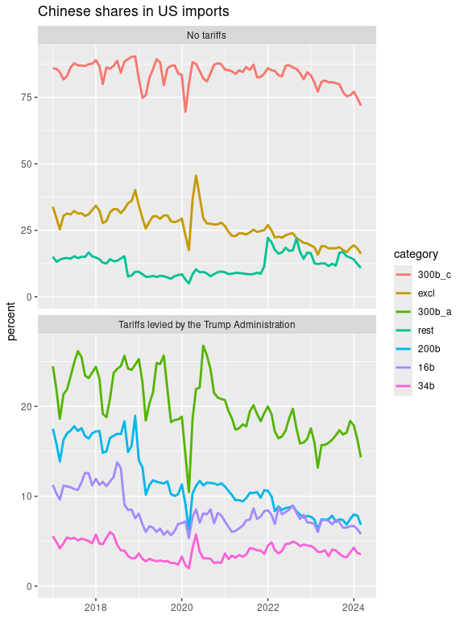

US tariffs on China
================
Mitsuo Shiota
2019-04-17

  - [Summary](#summary)
  - [Libraries and functions](#libraries-and-functions)
  - [Extract HTS 8 digit codes from USTR
    lists](#extract-hts-8-digit-codes-from-ustr-lists)
  - [Extract HTS 10 digit codes from exclusion
    lists](#extract-hts-10-digit-codes-from-exclusion-lists)
  - [Get international trade data, and confirm USTR
    claims](#get-international-trade-data-and-confirm-ustr-claims)
  - [How much imports are excluded so
    far?](#how-much-imports-are-excluded-so-far)
  - [Look at the Chinese share
    movements](#look-at-the-chinese-share-movements)

Updated: 2019-09-09

I began to use censusapi package.

I added a category “excl” which are excluded from imposed tariffs by
USTR.

I added an analysis of Chinese retariation tariff lists in [another
page](China-hits-back3.md).

I added an analysis of who pays tariffs in [another page](Who-pays.md).

## Summary

  - [Chinese shares in US imports in tariff imposed goods and others in
    pdf](output/chinese-shares.pdf)
  - [Chinese shares in HTS 8 digit imports by tariff schedule (2018) in
    pdf](output/chinese-shares2.pdf)

I extract 8 digit HTS (Harmonized Tariff Scedule of the United States)
codes from the three USTR documents (pdf format). I also extract 10
digit HTS codes from granted product exclusion lists. These lists can be
found on [this USTR
page](https://ustr.gov/issue-areas/enforcement/section-301-investigations/tariff-actions).

Next, I get data via API from [Census Bureau U.S. International Trade
Data](https://www.census.gov/foreign-trade/data/), and confirm the each
list is really worth 34, 16 and 200 billion dollars respectively.

I calculate the Chinese shares on those tariff-imposed goods, excluded
goods and not-imposed goods, and look at the shares movements from
January 2017 to now to know how much trade diversion is going. I also
draw a boxplot of Chinese shares in HTS 10 digit imports in 2018.

## Libraries and functions

As usual, I attach tidyverse package. Although I don’t attach, I use
pdftools package to read pdf files, keyring package to input API Key,
and httr package to get data from URL. As I have found that censusapi
package works, I use it.

I make functions to facilitate data transformation and acquisition.

## Extract HTS 8 digit codes from USTR lists

pdftools::pdf\_text lets me scan a pdf file by page. stringr package in
tidyverse helps me to extract 8 digits.

USTR says the numbers of HTS 8 digit items are 818, 279 and 5745 for the
first tranche 34b, the second tranche 16b and the last 200b,
respectively. My caluculation says the numbers are 818, 283 and 5765.
Although there are small differences, I think I can ignore.

## Extract HTS 10 digit codes from exclusion lists

USTR announces exclusions periodically. Exclusions are specified by HTS
10 digit codes.

## Get international trade data, and confirm USTR claims

Following the recommendation in [Internatinal Trade Data API User
Guide](https://www.census.gov/foreign-trade/reference/guides/Guide%20to%20International%20Trade%20Datasets.pdf)
provided by the US Census Bureau, I register API Key. keyring package
allows me to input API Key, and use it, without making it public.

I struggle with which table I should use, and reach [this
page](https://www.census.gov/data/developers/data-sets/international-trade.html).
Next I struggle with which variables I should use, and reach [this
page](https://api.census.gov/data/timeseries/intltrade/imports/hs/variables.html).
I experiment a little, and know that GEN\_CIF\_MO = GEN\_VAL\_MO +
GEN\_CHA\_MO. Looks like CIF basis = FOB basis + Freight, insurance and
other charges. I choose GEN\_CIF\_MO as import value.

I get to know the country code of China is 5700 from [this
page](https://www.census.gov/foreign-trade/schedules/c/countryname.html).
OK, let us get data. Each download takes approximately half a minute.

Using the tariff lists of 8 digit HTS codes I extracted before, I check
if 2018 imports are really worth as much as 34, 16 and 200 billion
dollars as USTR claims. According to my calculation, 2018 imports are
32.2, 15.2 and 192.5 billion dollars. Ratios to the USTR claims are
0.95, 0.95 and 0.96. Little bit smaller, but basically confirm the USTR
claims.

2018 imports in List 4 Annex A (“300b\_a”, effective on September 1,
2019) and Annex C (“300b\_c”, will be effective on December 15, 2019)
are 110.4 and 160.6 billion dollars respectively.

## How much imports are excluded so far?

So far USTR announced exclusion lists 8 times. They specify products
simply by HTS 10 digit code, or by product description and HTS 10 digit
code it belong to. When I caluculate simply by HTS 10 digit code,
exclusions amount to 16.8 billion dollars annually.

## Look at the Chinese share movements

I get imports from China and total imports from January 2017 up to now,
and calculate Chinese shares in imports in each category that is “34b”,
“16b”, “200b” imposed tariffs effective on July 6, 2018, August 23,
2018, and September 24, 2018, “excl” which is excluded, and “the rest”
which is not imposed tariffs.

What can I say from the chart below?

1.  Chinese shares are the lowest in 34b, next lowest in 16b, higher in 200b,
    even higher in 300b\_a and much much higer in 300b\_c, exactly the same 
    order of imposing tariffs. Actually USTR states that they separate 300b
    into 300b\_a and 300b\_c based on whether the Chinese shares are less than
    75 percent or not in [this page](https://ustr.gov/sites/default/files/enforcement/301Investigations/Notice_of_Modification_%28List_4A_and_List_4B%29.pdf).
    USTR tends to choose lower Chinese share goods to impose tariffs first
    to avoid supply chain distruptions.

2.  In both 34b and 16b, Chinese shares rise just before the effective
    date, and decline thereafter. This pattern reflects that importers
    rush before and flee after.

3.  In 200b, I can see the small same pattern, but see bigger rise in
    December 2018 just before the tariff rates were scheduled to rise
    from 10 to 25 percent, and bigger decline thereafter. Looks like
    importers care little of 10 percent, but care much of 25 percent.

4.  In the tariff imposed goods, Chinese shares are declining. This
    means other countries’ shares are rising. Trade diversion is going
    on.

5.  Seasonality is observed. Chinese shares fall around March every
    year, as Chinese take long vacations when their New Year begins
    around February.

6.  Chinese shares in “excl” have declined. We will see recovery after
    exclusion.

<!-- -->

To confirm the point \#1 above, I draw the distribution of 2018 Chinese
shares in HTS 10 digit goods by each tariff schedule category. Chinese
shares in “excl” are much higher than “34b”, “16b” and “200b” from which
“excl” is excluded. As the shares in "300b\_c" (will be effective on December 15, 2019) are much much higer than those of "excl", USTR will receive massive product exclusion requests.

<!-- -->

EOL
