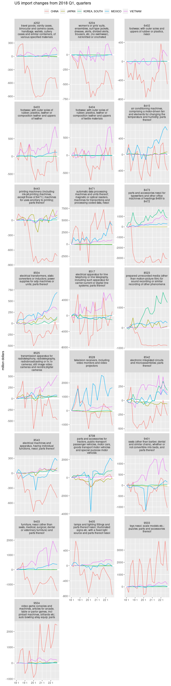

Who replaces China in US imports?
================
Mitsuo Shiota
2019-08-06

- [Summary](#summary)
- [Libraries and functions](#libraries-and-functions)
- [Download data](#download-data)
- [Choose HS codes](#choose-hs-codes)
- [Draw charts of US import changes from 2018 Q1 from each
  country](#draw-charts-of-us-import-changes-from-2018-q1-from-each-country)

Updated: 2024-02-08

## Summary

US imports from China are decreasing in 2019 due to tariffs, and in 2020
due to novel coronavirus. If trade diversion is going on, other
countries are replacing China. In this study, I somewhat arbitrarily
choose 4 candidate countries like Vietnam, Korea, Japan and Mexico, and
check whether the US imports from these countries increase by HS 4 digit
codes.

## Libraries and functions

I use `tidyverse` and `tsibble` packages.

## Download data

I download US monthly imports from China, Vietnam, Korea, Japan and
Mexico by HS 4 digit codes since 2017, convert to quartely, and fill 0s
in gaps.

## Choose HS codes

I choose imports from China which once declined from 2018 Q1 by more
than 500 million dollars.

## Draw charts of US import changes from 2018 Q1 from each country

For the goods descriptions of HS codes, I refer to
<https://dataweb.usitc.gov/classification/commodity-description/HTS/4>.

    ## Warning: Using `size` aesthetic for lines was deprecated in ggplot2 3.4.0.
    ## ℹ Please use `linewidth` instead.
    ## This warning is displayed once every 8 hours.
    ## Call `lifecycle::last_lifecycle_warnings()` to see where this warning was
    ## generated.

<!-- -->

EOL
