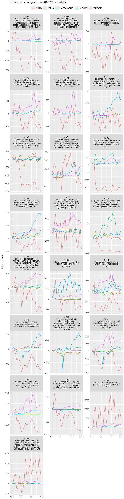

Who replaces China in US imports?
================
Mitsuo Shiota
2019-08-06

  - [Summary](#summary)
  - [Libraries and functions](#libraries-and-functions)
  - [Download data](#download-data)
  - [Choose HS codes of which imports from China declined significantly
    in 2019
    4Q](#choose-hs-codes-of-which-imports-from-china-declined-significantly-in-2019-4q)
  - [Draw charts of US import changes from a year earlier from each
    country](#draw-charts-of-us-import-changes-from-a-year-earlier-from-each-country)

Updated: 2020-02-06

## Summary

US imports from China are decreasing in 2019. If trade diversion is goin
on, other countries are replacing China. In this study, I somewhat
arbitrarily choose 4 candidate countries like Vietnam, Korea, Japan and
Mexico, and check whether the US imports from these countries increase
by HS 4 digit codes.

## Libraries and functions

I use self-made package `tqr`.

## Download data

I download US monthly imports from China, Vietnam, Korea, Japan and
Mexico by HS 4 digit codes since 2017, convert to quartely, and fill 0s
in gaps.

After I fill zeros in gaps, the number of rows is 72720. As it matches 5
(number of countries) times 1212 (number of unique hs goods), I can
confirm there are no gaps, and safely use `tqr` package which utilizes
lags.

## Choose HS codes of which imports from China declined significantly in 2019 4Q

I first choose HS codes of which imports from China declined by more
than 200 million dollars in 2019 4Q. Next I choose HS codes of which
imports from China are still more than 500 million dollars in 2019 4Q.

## Draw charts of US import changes from a year earlier from each country

For the goods descriptions of HS codes, refer to
<http://www.kanzei.or.jp/statistical/expstatis/headline/hs2dig/e/85>.

Most notable case is that Vietnam replaces China as a main export base
of 8517 (telephone sets), probably smart phones. Smart phones are not
yet imposed tariffs by the US. This replacement is caused by Samsung’s
strategy to expand smart phone production capacity in Vietnam, and by
ZTE and Huawei losing shares in the US.

Vietnam is also advancing in 8544 (Cables), 9401 (Seats) and 9403 (Other
furniture).

Japan, South Korea and Mexico all supplant China in 8523 (Recording
medium).

Mexico replaces China in 8708 (Auto parts).

<!-- -->

EOL
