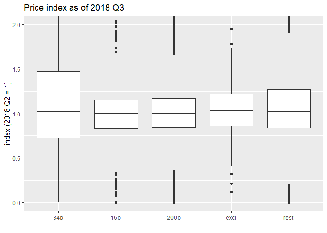
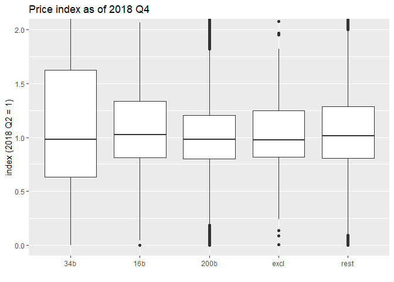
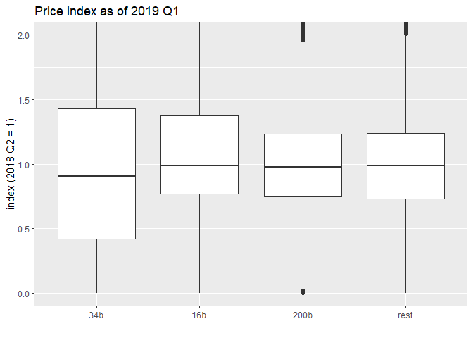

Who pays tariffs?
================
Mitsuo Shiota
2019-05-13

  - [Summary](#summary)
  - [Libraries and functions](#libraries-and-functions)
  - [Extract HTS 8 digit codes from pdf
    files](#extract-hts-8-digit-codes-from-pdf-files)
  - [Get monthly import data](#get-monthly-import-data)
  - [Transform into quarterly data](#transform-into-quarterly-data)
  - [Look at the price changes from 2018
    Q2](#look-at-the-price-changes-from-2018-q2)

Updated: 2019-05-14

## Summary

On May 11, 2019, Japanese newspaper Nikkei reported that China pays most
of the tariffs by cutting export prices, basically confirming [the US
President’s
tweet](https://twitter.com/realDonaldTrump/status/1126815126584266753).
I was surprised, as [US import price index:
China](https://fred.stlouisfed.org/series/CHNTOT) has not yet declined
so much. So I have decided to check how US import prices from China
changed from 2018 Q2, just before the first tranche “34b” became
effective, for each HTS 10 digit code item, and compare the changes by
tariff schedule category.

Result: Although the median price of the first tranche “34b” dropped
nearly 10 percent in 2019 Q1, the others (“16b” and “200b”) dropped only
2 percent, as much as non-tariff levied items (“rest”) dropped. This
suggests China pays a third of tariffs in “34b”, and nothing in “16b”
and “200b”. I can’t confirm the Nikkei report.

## Libraries and functions

Looking at [census data
page](https://api.census.gov/data/timeseries/intltrade/imports/hs/variables.html),
I decide to select “GEN\_VAL\_MO” as value, and “CON\_QY1\_MO” as
quantity, though I selected “GEN\_CIF\_MO” as value in [the original
analysis](README.md).

## Extract HTS 8 digit codes from pdf files

I repeat the HTS 8 digit code scratching, as I have done in [the
original analysis](README.md).

## Get monthly import data

The number of HTS 10 digit code items are 14773.

## Transform into quarterly data

I change data from monthly to quarterly, as I have to drop so many data
to calculate unit price as value divided by quantity in monthly data. I
index unit price as of 2018 2Q equals to one, and add tariff schedule
category (“34b”, “16b”, “200b”, “rest”) to each item.

Now, the number of HTS 10 digit code items are 11800.

## Look at the price changes from 2018 Q2

Look at 2018 Q3. In some non-commodity items, products are so different,
and it is difficult to interpret value per quantity changes as price
changes. So I think we had better ignore outliers, and look at the
median of price indices by each category.

    ## # A tibble: 4 x 2
    ## # Groups:   category [4]
    ##   category     n
    ##   <fct>    <int>
    ## 1 34b        873
    ## 2 16b        318
    ## 3 200b      5015
    ## 4 rest      4175

    ## # A tibble: 4 x 2
    ##   category median
    ##   <fct>     <dbl>
    ## 1 34b        1.02
    ## 2 16b        1.00
    ## 3 200b       1.00
    ## 4 rest       1.02

<!-- -->

I also calculate value-weighted mean prices. When I trim somewhat
arbitrarily by removing more than 6 times price increase items, the
indices are almost same across tariff schedule categories. But trimming
is arbitrary. I think we had better look at median than value-weighted
mean.

    ## # A tibble: 4 x 2
    ##   category w_mean
    ##   <fct>     <dbl>
    ## 1 34b        1.11
    ## 2 16b        1.16
    ## 3 200b       1.04
    ## 4 rest       1.01

Look at 2018 Q4.

    ## # A tibble: 4 x 2
    ## # Groups:   category [4]
    ##   category     n
    ##   <fct>    <int>
    ## 1 34b        866
    ## 2 16b        311
    ## 3 200b      4919
    ## 4 rest      4149

    ## # A tibble: 4 x 2
    ##   category median
    ##   <fct>     <dbl>
    ## 1 34b       0.977
    ## 2 16b       1.04 
    ## 3 200b      0.980
    ## 4 rest      1.01

<!-- -->

    ## # A tibble: 4 x 2
    ##   category w_mean
    ##   <fct>     <dbl>
    ## 1 34b        1.08
    ## 2 16b        1.16
    ## 3 200b       1.04
    ## 4 rest       1.01

Look at 2019 Q1.

    ## # A tibble: 4 x 2
    ## # Groups:   category [4]
    ##   category     n
    ##   <fct>    <int>
    ## 1 34b        997
    ## 2 16b        322
    ## 3 200b      5023
    ## 4 rest      4311

    ## # A tibble: 4 x 2
    ##   category median
    ##   <fct>     <dbl>
    ## 1 34b       0.906
    ## 2 16b       0.989
    ## 3 200b      0.974
    ## 4 rest      0.988

<!-- -->

    ## # A tibble: 4 x 2
    ##   category w_mean
    ##   <fct>     <dbl>
    ## 1 34b       0.887
    ## 2 16b       0.916
    ## 3 200b      0.922
    ## 4 rest      0.901

EOL
