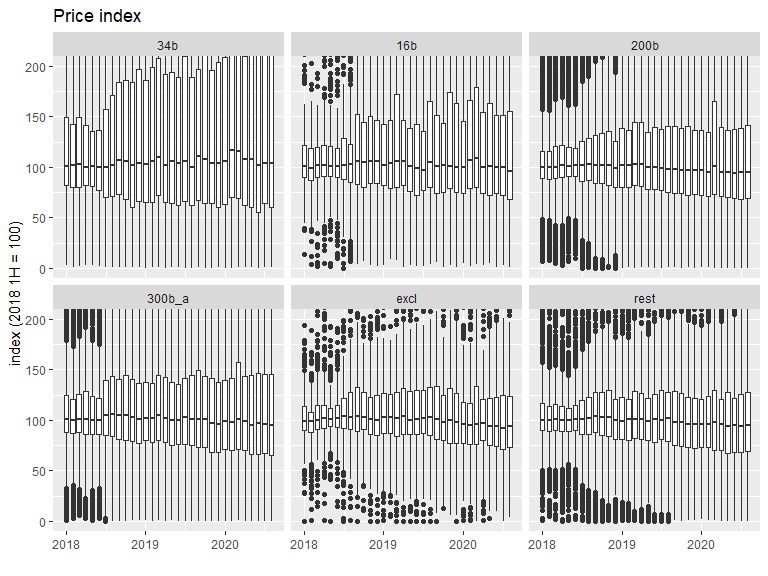
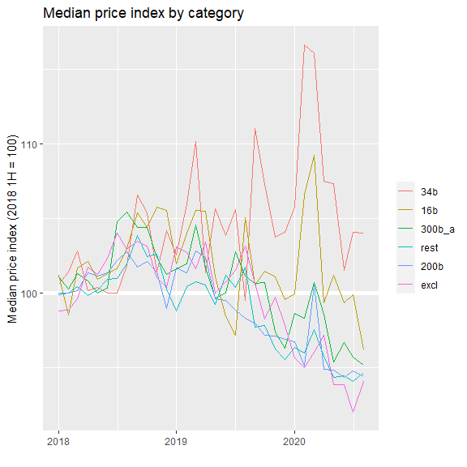

Who pays tariffs?
================
Mitsuo Shiota
2019-05-13

  - [Motivation and purpose](#motivation-and-purpose)
  - [Libraries and functions](#libraries-and-functions)
  - [Extract HTS 8 digit codes for “34b”, “16b”, “200b” and “300b\_a”,
    and 10 digit codes for
    “excl”](#extract-hts-8-digit-codes-for-34b-16b-200b-and-300b_a-and-10-digit-codes-for-excl)
  - [Get monthly import data](#get-monthly-import-data)
  - [Index unit price of the first half of 2018 as
    100](#index-unit-price-of-the-first-half-of-2018-as-100)
  - [Look at the price changes from the first half of
    2018](#look-at-the-price-changes-from-the-first-half-of-2018)
  - [Correction](#correction)

Updated: 2021-01-08

## Motivation and purpose

On May 11, 2019, Japanese newspaper Nikkei reported that China pays most
of the tariffs by cutting export prices, basically confirming [the US
President’s
tweet](https://twitter.com/realDonaldTrump/status/1126815126584266753).
I was surprised, as [US import price index:
China](https://fred.stlouisfed.org/series/CHNTOT) has not yet declined
so much. So I have decided to check how US import prices from China
changed from the first half of 2018, just before the first tranche “34b”
became effective, for each HTS 10 digit code item, and see the changes
by tariff schedule category.

## Libraries and functions

Looking at [census data
page](https://api.census.gov/data/timeseries/intltrade/imports/hs/variables.html),
I decide to select “GEN\_VAL\_MO” as value, “CON\_QY1\_MO” as quantity1,
and “CON\_QY2\_MO” as quantity2, though I selected “GEN\_CIF\_MO” as
value in [the original analysis](README.md).

## Extract HTS 8 digit codes for “34b”, “16b”, “200b” and “300b\_a”, and 10 digit codes for “excl”

I load tariff lists I have saved in [the separate
page](Extract-hts-from-USTR.md).

## Get monthly import data

The number of HTS 10 digit code items are 15672.

## Index unit price of the first half of 2018 as 100

As I have to drop so many data to calculate unit price as value divided
by quantity in a specific month, I index unit price as of the first half
of 2018 equals to 100.

I add tariff schedule category (“34b”, “16b”, “200b”, “300b\_a”, “rest”)
to each item.

The number of HTS 10 digit code items by category are as below.

    ## # A tibble: 6 x 2
    ## # Groups:   category [6]
    ##   category     n
    ##   <fct>    <int>
    ## 1 34b       1203
    ## 2 16b        337
    ## 3 200b      6139
    ## 4 300b_a    3855
    ## 5 excl       450
    ## 6 rest      1484

## Look at the price changes from the first half of 2018

As I index the first half of 2018 as 100, the price range in this period
is naturally narrow. “34b”, “16b”, “200b” and “300b\_a” imposed tariffs
got effective on July 6, 2018, August 23, 2018, September 24, 2018, and
September 1, 2019, respectively. If Chinese pay tariffs, prices fall
after the effective date.

<!-- -->

In some non-commodity items, products are so different, and it is
difficult to interpret value per quantity changes as price changes. So I
think we had better ignore outliers, and look at the medians of price
indices by each category.

<!-- -->

In the latest month, median price indices by category are as below.

    ## # A tibble: 6 x 3
    ## # Groups:   category [6]
    ##   category time       index
    ##   <fct>    <date>     <dbl>
    ## 1 34b      2020-11-01  58.3
    ## 2 16b      2020-11-01  91.7
    ## 3 200b     2020-11-01  88.5
    ## 4 300b_a   2020-11-01  86.3
    ## 5 excl     2020-11-01  79.1
    ## 6 rest     2020-11-01  87.6

Chinese are paying 41.7 out of 25 percent in “34b”, 8.3 out of 25 in
“16b”, 11.5 out of 25 in “200b”, and 13.7 out of 7.5 in “300b\_a” in
the latest month. Should I subtract 12.4 percent decline of “rest”?

## Correction

On October 26, 2020, I found price index movements above are not
compatible with [US import price index: China, in
total](https://fred.stlouisfed.org/series/CHNTOT). In 2020, every price
index of tariff schedule category above shows rapid decline, while the
total price index shows stabilization or even a bit of increase.

Then I noticed there are a lot of zeroes in 2020 in the price index box
plots above, especially those of “34b” and “excl”. Price index, which is
value divided by quantity and is standardized, can’t be zero. It turned
out there are 21833 zero indices.

Where these zero indices come from? Small parts, 829, come from zero
values. Most parts must come from standardization. It leads to my guess
that unit is revised at the start of every year.

``` r
# zero indices in 2018
df_m %>% 
  filter(index == 0, time >= "2018-01-01", time < "2019-01-01") %>% 
  nrow()
```

    ## [1] 314

``` r
# in 2019
df_m %>% 
  filter(index == 0, time >= "2019-01-01", time < "2020-01-01") %>% 
  nrow()
```

    ## [1] 7346

``` r
# in 2020
df_m %>% 
  filter(index == 0, time >= "2020-01-01") %>% 
  nrow()
```

    ## [1] 14173

If unit is inconsistent over years, my method of calculation of price
index is meaningless. Let us check ‘unit1’ column, which is supposed to
be 3-character import unit of quantity.

``` r
head(df_m_raw)
```

    ##         time       hs10      hs8   value quantity1 unit1 quantity2 unit2
    ## 1 2018-01-01 0106110000 01061100 3041638      1320    NA         0    NA
    ## 2 2018-01-01 0106199195 01061991   10650       228    NA         0    NA
    ## 3 2018-01-01 0204432000 02044320   81634     14051    NA         0    NA
    ## 4 2018-01-01 0208100000 02081000  196370     46000    NA         0    NA
    ## 5 2018-01-01 0208902500 02089025 1269300    243862    NA         0    NA
    ## 6 2018-01-01 0301110020 03011100  122342         0    NA         0    NA

``` r
df_m_raw %>%
  drop_na(unit1)
```

    ## [1] time      hs10      hs8       value     quantity1 unit1     quantity2
    ## [8] unit2    
    ## <0 rows> (or 0-length row.names)

It turns out ‘unit1’ column is all NAs. How about ‘unit2’ column?

``` r
df_m_raw %>%
  drop_na(unit2)
```

    ## [1] time      hs10      hs8       value     quantity1 unit1     quantity2
    ## [8] unit2    
    ## <0 rows> (or 0-length row.names)

‘unit2’ column is all NAs, too. I can’t check unit consistency.

As a last resort, I remove zero value and zero index, and recalculate
below.

The number of HTS 10 digit code items by category are as below.

    ## # A tibble: 6 x 2
    ## # Groups:   category [6]
    ##   category     n
    ##   <fct>    <int>
    ## 1 34b        889
    ## 2 16b        314
    ## 3 200b      5671
    ## 4 300b_a    3557
    ## 5 excl       336
    ## 6 rest      1295

Box plots.

<!-- -->

Line charts.

<!-- -->

In the latest month, median price indices by category are as below.

    ## # A tibble: 6 x 3
    ## # Groups:   category [6]
    ##   category time       index
    ##   <fct>    <date>     <dbl>
    ## 1 34b      2020-11-01  99.5
    ## 2 16b      2020-11-01  99.0
    ## 3 200b     2020-11-01  93.9
    ## 4 300b_a   2020-11-01  92.0
    ## 5 excl     2020-11-01  90.6
    ## 6 rest     2020-11-01  94.8

Chinese are paying 0.5 out of 25 percent in “34b”, 1 out of 25 in “16b”,
6.1 out of 25 in “200b”, and 8 out of 7.5 in “300b\_a” in the latest
month. Should I subtract 5.2 percent decline of “rest”?

Looks less incompatible with [US import price index: China, in
total](https://fred.stlouisfed.org/series/CHNTOT), though volatile “34b”
suggests I had better cut off high indices at certain level.

EOL
