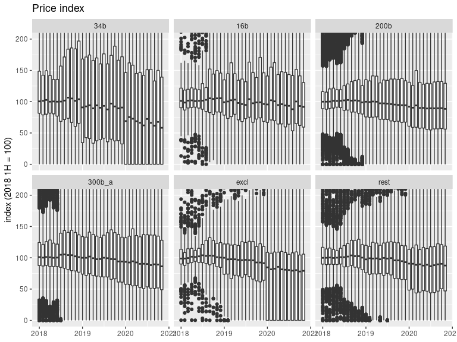
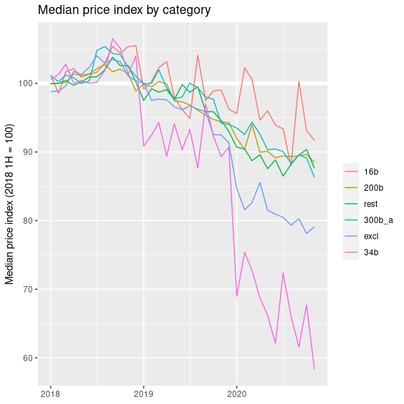

Who pays tariffs?
================
Mitsuo Shiota
2019-05-13

  - [Motivation and purpose](#motivation-and-purpose)
  - [Libraries and functions](#libraries-and-functions)
  - [Extract HTS 8 digit codes for “34b”, “16b”, “200b” and “300b\_a”,
    and 10 digit codes for
    “excl”](#extract-hts-8-digit-codes-for-34b-16b-200b-and-300b_a-and-10-digit-codes-for-excl)
  - [Get monthly import data](#get-monthly-import-data)
  - [Index unit price of the first half of 2018 as
    100](#index-unit-price-of-the-first-half-of-2018-as-100)
  - [Look at the price changes from the first half of
    2018](#look-at-the-price-changes-from-the-first-half-of-2018)

Updated: 2020-07-05

## Motivation and purpose

On May 11, 2019, Japanese newspaper Nikkei reported that China pays most
of the tariffs by cutting export prices, basically confirming [the US
President’s
tweet](https://twitter.com/realDonaldTrump/status/1126815126584266753).
I was surprised, as [US import price index:
China](https://fred.stlouisfed.org/series/CHNTOT) has not yet declined
so much. So I have decided to check how US import prices from China
changed from the first half of 2018, just before the first tranche “34b”
became effective, for each HTS 10 digit code item, and see the changes
by tariff schedule category.

## Libraries and functions

Looking at [census data
page](https://api.census.gov/data/timeseries/intltrade/imports/hs/variables.html),
I decide to select “GEN\_VAL\_MO” as value, and “CON\_QY1\_MO” as
quantity, though I selected “GEN\_CIF\_MO” as value in [the original
analysis](README.md).

## Extract HTS 8 digit codes for “34b”, “16b”, “200b” and “300b\_a”, and 10 digit codes for “excl”

I load tariff lists I have saved in [the separate
page](Extract-hts-from-USTR.md).

## Get monthly import data

The number of HTS 10 digit code items are 15430.

## Index unit price of the first half of 2018 as 100

As I have to drop so many data to calculate unit price as value divided
by quantity in a specific month, I index unit price as of the first half
of 2018 equals to 100.

I add tariff schedule category (“34b”, “16b”, “200b”, “300b\_a”, “rest”)
to each item.

The number of HTS 10 digit code items by category are as below.

    ## # A tibble: 6 x 2
    ## # Groups:   category [6]
    ##   category     n
    ##   <fct>    <int>
    ## 1 34b       1200
    ## 2 16b        337
    ## 3 200b      6132
    ## 4 300b_a    3852
    ## 5 excl       449
    ## 6 rest      1481

## Look at the price changes from the first half of 2018

As I index the first half of 2018 as 100, the price range in this period
is naturally narrow. “34b”, “16b”, “200b” and “300b\_a” imposed tariffs
got effective on July 6, 2018, August 23, 2018, September 24, 2018, and
September 1, 2019, respectively. If Chinese pay tariffs, prices fall
after the effective date.

<!-- -->

In some non-commodity items, products are so different, and it is
difficult to interpret value per quantity changes as price changes. So I
think we had better ignore outliers, and look at the medians of price
indices by each category.

<!-- -->

In the latest month, median price indices by category are as below.

    ## # A tibble: 6 x 3
    ## # Groups:   category [6]
    ##   category time       index
    ##   <fct>    <date>     <dbl>
    ## 1 34b      2020-05-01  66.2
    ## 2 16b      2020-05-01  96.0
    ## 3 200b     2020-05-01  90.1
    ## 4 300b_a   2020-05-01  90.3
    ## 5 excl     2020-05-01  81.5
    ## 6 rest     2020-05-01  87.6

Chinese are paying 33.8 out of 25 percent in “34b”, 4 out of 25 in
“16b”, 9.9 out of 25 in “200b”, and 9.7 out of 7.5 in “300b\_a” in
the latest month. Sould I subtract 12.4 percent decline of “rest”?

EOL
