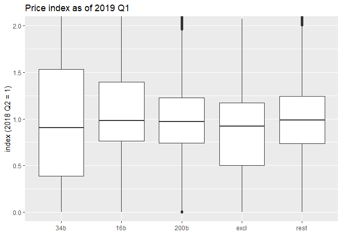

Who pays tariffs?
================
Mitsuo Shiota
2019-05-13

  - [Summary](#summary)
  - [Libraries and functions](#libraries-and-functions)
  - [Extract HTS 8 digit codes for “34b”, “16b” and “200b”, and 10 digit
    codes for
    “excl”](#extract-hts-8-digit-codes-for-34b-16b-and-200b-and-10-digit-codes-for-excl)
  - [Get monthly import data](#get-monthly-import-data)
  - [Transform into quarterly data](#transform-into-quarterly-data)
  - [Look at the price changes from 2018
    Q2](#look-at-the-price-changes-from-2018-q2)

Updated: 2019-08-05

## Summary

On May 11, 2019, Japanese newspaper Nikkei reported that China pays most
of the tariffs by cutting export prices, basically confirming [the US
President’s
tweet](https://twitter.com/realDonaldTrump/status/1126815126584266753).
I was surprised, as [US import price index:
China](https://fred.stlouisfed.org/series/CHNTOT) has not yet declined
so much. So I have decided to check how US import prices from China
changed from 2018 Q2, just before the first tranche “34b” became
effective, for each HTS 10 digit code item, and compare the changes by
tariff schedule category.

Result: Although the median price of the first tranche “34b” has dropped
approximately 8 percent more than non-tariff levied items (“rest”) since
2019 Q1, the others (“16b” and “200b”) have dropped less than 1 percent
more than “rest”. This suggests China pays a third of tariffs in “34b”,
and nothing in “16b” and “200b”. I can’t confirm the Nikkei report.

## Libraries and functions

Looking at [census data
page](https://api.census.gov/data/timeseries/intltrade/imports/hs/variables.html),
I decide to select “GEN\_VAL\_MO” as value, and “CON\_QY1\_MO” as
quantity, though I selected “GEN\_CIF\_MO” as value in [the original
analysis](README.md).

## Extract HTS 8 digit codes for “34b”, “16b” and “200b”, and 10 digit codes for “excl”

I repeat the HTS 8 and 10 digit code scratching, as I have done in [the
original analysis](README.md).

## Get monthly import data

The number of HTS 10 digit code items are 14930.

## Transform into quarterly data

I change data from monthly to quarterly, as I have to drop so many data
to calculate unit price as value divided by quantity in monthly data. I
index unit price as of 2018 2Q equals to one, and add tariff schedule
category (“34b”, “16b”, “200b”, “rest”) to each item.

Now, the number of HTS 10 digit code items are 11789.

## Look at the price changes from 2018 Q2

Look at 2018 Q3. In some non-commodity items, products are so different,
and it is difficult to interpret value per quantity changes as price
changes. So I think we had better ignore outliers, and look at the
medians of price indices by each category.

As “34b”, “16b”, “200b” imposed tariffs got effective on July 6, 2018,
August 23, 2018, and September 24, 2018, nothing happened in the medians
of price indices in 2018 Q3.

Suppose “rest” is the base line, then the differeces with “rest”
(“diff\_rest”) are the tariff effects on median import prices by each
category.

    ## # A tibble: 5 x 2
    ## # Groups:   category [5]
    ##   category     n
    ##   <fct>    <int>
    ## 1 34b        761
    ## 2 16b        289
    ## 3 200b      4969
    ## 4 excl       142
    ## 5 rest      4204

    ## # A tibble: 5 x 4
    ## # Groups:   quarter [1]
    ##   quarter   category median diff_rest
    ##   <yearqtr> <fct>     <dbl>     <dbl>
    ## 1 2018 Q3   34b        1.02  -0.00304
    ## 2 2018 Q3   16b        1.00  -0.0158 
    ## 3 2018 Q3   200b       1     -0.0197 
    ## 4 2018 Q3   excl       1.03   0.0140 
    ## 5 2018 Q3   rest       1.02   0

<!-- -->

Look at 2018 Q4. Nothing significant happened.

    ## # A tibble: 5 x 2
    ## # Groups:   category [5]
    ##   category     n
    ##   <fct>    <int>
    ## 1 34b        755
    ## 2 16b        282
    ## 3 200b      4910
    ## 4 excl       143
    ## 5 rest      4144

    ## # A tibble: 5 x 4
    ## # Groups:   quarter [1]
    ##   quarter   category median diff_rest
    ##   <yearqtr> <fct>     <dbl>     <dbl>
    ## 1 2018 Q4   34b       0.982   -0.0296
    ## 2 2018 Q4   16b       1.03     0.0134
    ## 3 2018 Q4   200b      0.980   -0.0321
    ## 4 2018 Q4   excl      0.977   -0.0348
    ## 5 2018 Q4   rest      1.01     0

<!-- -->

Look at 2019 Q1. Now “34b” median price index is 8 percent lower than
“rest”. Approximately a third (8 out of 25) of imposed tariffs in
“34b” can be intrepreted being paid by Chinese exporters. As for
“16b” and “200b”, Chinese exporters pay almost nothing.

    ## # A tibble: 5 x 2
    ## # Groups:   category [5]
    ##   category     n
    ##   <fct>    <int>
    ## 1 34b        864
    ## 2 16b        288
    ## 3 200b      5008
    ## 4 excl       175
    ## 5 rest      4312

    ## # A tibble: 5 x 4
    ## # Groups:   quarter [1]
    ##   quarter   category median diff_rest
    ##   <yearqtr> <fct>     <dbl>     <dbl>
    ## 1 2019 Q1   34b       0.904  -0.0825 
    ## 2 2019 Q1   16b       0.983  -0.00398
    ## 3 2019 Q1   200b      0.973  -0.0140 
    ## 4 2019 Q1   excl      0.923  -0.0639 
    ## 5 2019 Q1   rest      0.987   0

<!-- -->

Look at 2019 Q2. We can see the same pattern as 2019 Q1. As for “34b”,
Chinese exporters pay approximately 8 percent out of imposed 25 percent
tariffs. As for “16b” and “200b”, they pay less than 1 percent.

    ## # A tibble: 5 x 2
    ## # Groups:   category [5]
    ##   category     n
    ##   <fct>    <int>
    ## 1 34b        881
    ## 2 16b        290
    ## 3 200b      4998
    ## 4 excl       175
    ## 5 rest      4286

    ## # A tibble: 5 x 4
    ## # Groups:   quarter [1]
    ##   quarter   category median diff_rest
    ##   <yearqtr> <fct>     <dbl>     <dbl>
    ## 1 2019 Q2   34b       0.897  -0.0773 
    ## 2 2019 Q2   16b       0.968  -0.00606
    ## 3 2019 Q2   200b      0.966  -0.00837
    ## 4 2019 Q2   excl      0.929  -0.0455 
    ## 5 2019 Q2   rest      0.974   0

<!-- -->

Look at the differeces with “rest” (“diff\_rest”) movement. “34b”
appears to be depressed by approximately 8 percent from 2019 1Q. “16b”
and “200b” prices are also depressed somewhat, but less than 1 percent
in 2019 2Q. Most of “excl” were parts of “34b”, and its prices fell in
2019 1Q, but are expected to recover since exclusion.

<!-- -->

EOL
